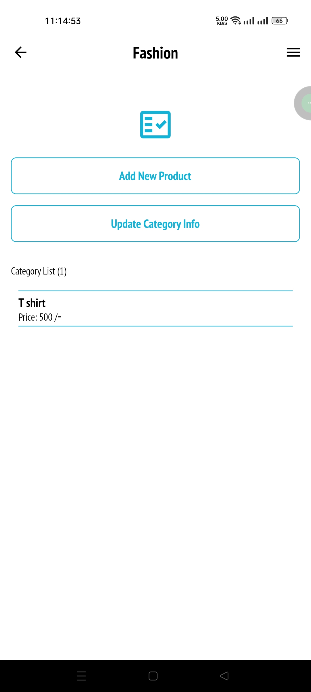

# Shop Manager

This is a demo shop management mobile application.
(Note: Because it is a free server, image file cannot be uploaded. Though I have implemented one of image upload work and commented out the code.)

## Tools and Technologies:
1. Flutter framework.
2. Dart programming language.

## Packages:
1. shared preferences (For save token in local storage)
2. http (For http request)

## Features:
1. Authentication.
2. Shop details.
3. User details.
4. Product category.
5. Product.
6. Cart (depend on customer app side).
7. Order (depend on customer app side).

## Screens:
1. Splash screen.
2. Log in screen.
3. Sign up screen.
4. Forget password screen.
5. Shop information screen.
6. Update shop information screen.
7. User list screen.
8. User details screen.
9. Add new user screen.
10. Update user information screen.
11. Category list screen.
12. Category wise product screen.
13. Add new category screen.
14. Update category information screen.
15. Add new product screen.
16. Product details screen.
17. Product update screen.

## API resources:
https://storexapi.herokuapp.com/

## Screenshots

  
  
  
  
  
  
  
  
  
  
  
  
  
  
  
  
  
  
  
  
  
  
  
  
